<!-- <h2 class="r-fit-text" style="text-align: center"> IA en el aula: Innovando la Educación del futuro </h2> -->

## Ciberseguridad e Inteligencia artificial
#### consideraciones y propuestas didácticas

 
---

## Desmitificando la ciberseguridad

### Mitos

* Los hackers son personas malintencionadas.<!-- .element: class="fragment" -->

* La ciberseguridad es demasiado compleja para usuarios no expertos.<!-- .element: class="fragment" -->

* Con un antivirus, mi dispositivo está completamente seguro.<!-- .element: class="fragment" -->

* No hay virus en Linux y Mac.<!-- .element: class="fragment" -->

* Si una página web tiene el candadito cerrado y/o verde, es 100% seguro.<!-- .element: class="fragment" -->

Note:
* Los hackers son personas malintencionadas.
Realidad: Existen hackers éticos, dedicados a fortalecer la seguridad, a través de pruebas de penetración y análisis de vulnerabilidades.

* La ciberseguridad es demasiado compleja para usuarios no expertos.
Realidad: Los fundamentos de la ciberseguridad son accesibles para todos, y pequeñas prácticas pueden hacer una gran diferencia.

* Con un antivirus, mi dispositivo está 100% seguro.
Realidad: Si bien el antivirus es una herramienta útil, no es una solución completa. La ciberseguridad es un enfoque en capas que requiere medidas adicionales.

* Los Macs no pueden ser infectados por virus.
Realidad: Todos los sistemas operativos son susceptibles a malware; la seguridad requiere vigilancia constante, sin importar la plataforma.

* El phishing es para atacar grandes empresas u organizaciones.
Realidad: Los ciberataques no tiene un único objetivo; las pequeñas empresas y la ciudadanía suelen ser más vulnerables.

* Si una página web tiene el candadito cerrado y/o verde, es 100% seguro.  
Realidad: El candado indica una conexión segura, pero no verifica la integridad del sitio. Siempre verifica la URL y la fuente del sitio.

* Por seguridad, nunca me conecto a Wi-Fi públicas, solo me conecto en casa o en la oficina.

* Solo recibo correos electrónicos seguros de amigos y familiares.<!-- .element: class="fragment" -->

* No tengo dinero, soy solo un usuario común, los ciberdelincuentes no se fijarán en mí.<!-- .element: class="fragment" -->

Note:

* Nunca accedo a mis cuentas en las Wi-Fi públicas, solo lo hago en casa o en la oficina. 
Realidad: El 80% de los ataques son internos, la seguridad es mas laxa.

* Solo recibo correos electrónicos seguros de amigos y familiares.
Realidad: Los ciberdelincuentes pueden suplantar identidades y enviar correos electrónicos falsos. Siempre verifica la autenticidad antes de hacer clic en enlaces o descargar archivos adjuntos.

* No tengo dinero, soy solo un usuario común, los ciberdelincuentes no se fijarán en mí.
Realidad: Todos los usuarios son blancos potenciales; los ataques no solo buscan dinero, sino también datos personales y acceso a redes.

### Algunas realidades...

* En promedio, ocurre un ciberataque cada 39 segundos (más de 1.250 ataques semanales solo en España).<!-- .element: class="fragment" -->

* Los ciberataques aumentaron en un 35% en 2023.<!-- .element: class="fragment" -->

* El 70% de los ciberataques están dirigidos a particulares y pequeñas empresas.<!-- .element: class="fragment" -->

* El costo global de la ciberdelincuencia se estima en $6 trillones anuales, superando el valor del narcotráfico.<!-- .element: class="fragment" -->

Note:

Estos puntos destacan la frecuencia, el crecimiento, la diversidad de víctimas y el impacto económico significativo de los ciberataques, proporcionando una perspectiva impactante y relevante para introducir tu curso.

- [Balance de Ciberseguridad 2022 (INCIBE)](https://portal.mineco.gob.es/RecursosNoticia/mineco/prensa/noticias/2023/Balance_de_Ciberseguridad_2022_INCIBE.pdf)

---

## Nuetro objetivo: Guía de Supervivencia

Note:
Representación creativa y simbólica de una "Guía de Supervivencia en Ciberseguridad" para profesorado.

###

* Crear juntos una guía práctica y realista.

* Aprenderemos a protegernos en el mundo digital.<!-- .element: class="fragment" -->

* No hay que temer, ¡estamos preparados!<!-- .element: class="fragment" -->

---

## Defensa en profundidad y seguridad por capas

---

## Protege tu espacio digital

---

### Cuando los USB se vuelven contra nosotros

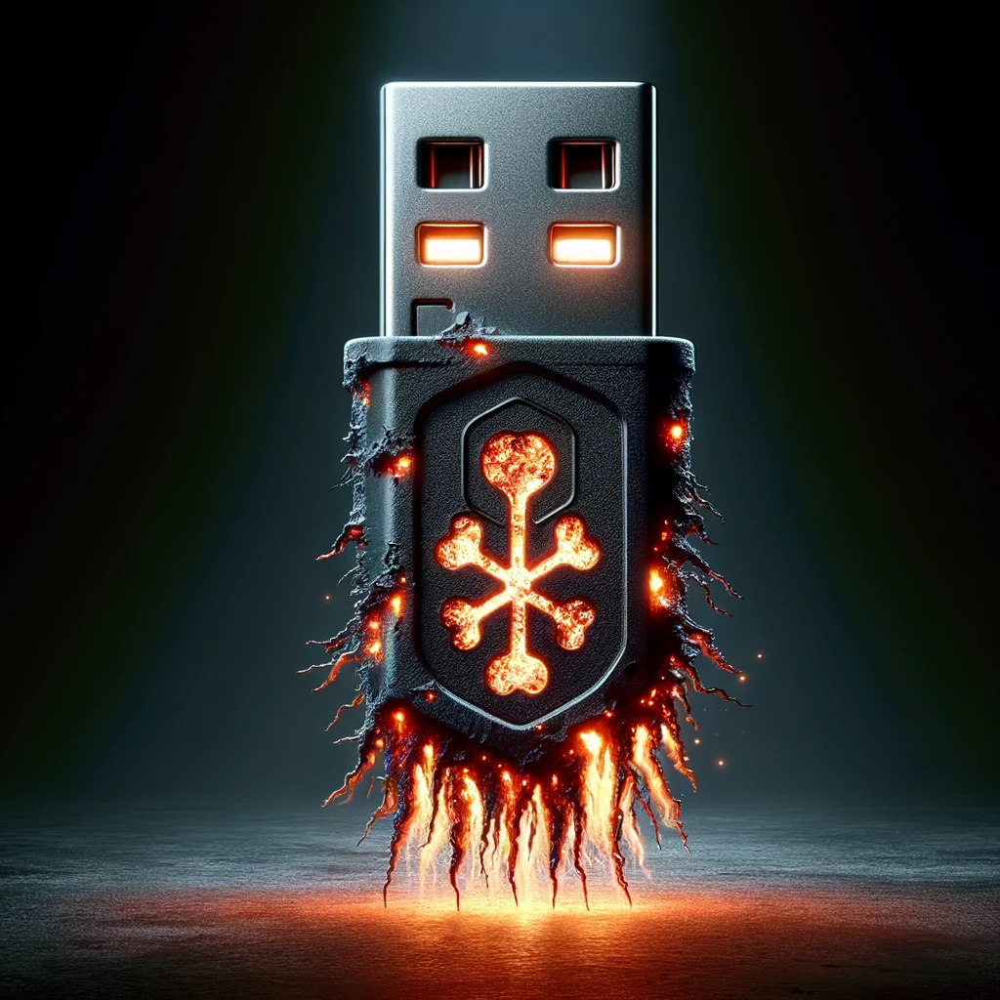

### 

* Daño físico: "USBs pueden quemar equipos".

* Malware oculto: "Riesgo de virus y spyware".<!-- .element: class="fragment" -->

* Robo de datos: "Extracción silenciosa de info".<!-- .element: class="fragment" -->

* Acceso no autorizado: "Permiten hackeos remotos".<!-- .element: class="fragment" -->

* Infiltración de red: "Puerta trasera a sistemas".<!-- .element: class="fragment" -->

### El Pato en Acción: Demostrando la Seguridad USB"

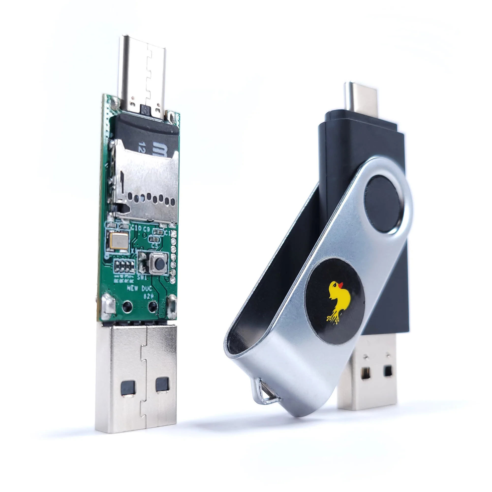

### 

* Desconfiar y no conectar a nuestros equipos dispositivos encontrados en espacios públicos o de origen desconocido.

* Deshabilitar la función de autoarranque de dispositivos USB. <!-- .element: class="fragment" -->

* Disponer de un antivirus activo y debidamente actualizado.<!-- .element: class="fragment" -->

### Deshabilitar la función de autoarranque de dispositivos USB

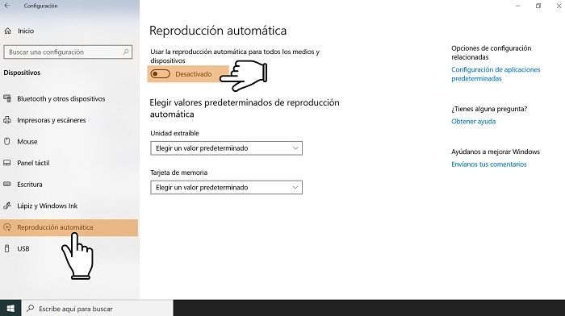

Note:
De este modo, si por error conectamos un dispositivo USB infectado a nuestro equipo, el malware o las herramientas que contenga no se activarán automáticamente, y podremos analizar y eliminar esas amenazas con un antivirus. En Windows, por ejemplo, para hacerlo deberemos acceder al icono de Windows > Configuración > Dispositivos > Reproducción automática y desactivar esta opción.

###

* Una vez conectado, haremos clic derecho sobre él.

* Luego, haremos clic sobre “Analizar con…”

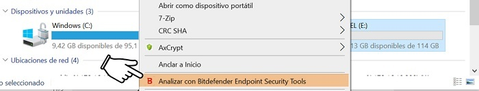

---

### Mantenimiento y salud digital

Note:
En esta sección, destacaremos la importancia del mantenimiento regular y la higiene digital. Veremos cómo una adecuada gestión de la limpieza digital mejora la funcionalidad de nuestros dispositivos y refuerza la seguridad. Examinaremos estrategias para mantener nuestros sistemas actualizados y cómo gestionar de manera segura los permisos de las aplicaciones. También discutiremos la importancia de realizar descargas conscientes. 

### El riesgo del síndrome de Diógenes digital

Note: 
Cada aplicación sin uso puede ser un talón de Aquiles en la armadura digital que salvaguarda nuestra información. Es importante abordar este desorden con una estrategia de limpieza digital meticulosa, eliminando lo que ya no sirve.

### 

* Dedica un momento a revisar todas las aplicaciones instaladas en tu dispositivo

* ¿Cuándo fue la última vez que utilizaste cada una? <!-- .element: class="fragment" -->

* ¿Su presencia es justificable?<!-- .element: class="fragment" -->

### 

* Cada app extra es un riesgo potencial. 

* Evitar instalaciones innecesarias: seguridad y eficiencia.
<!-- .element: class="fragment" -->

* Priorizar herramientas esenciales. <!-- .element: class="fragment" -->

* Revisión periódica de aplicaciones en uso. <!-- .element: class="fragment" -->

### Actualizaciones: Escudo digital

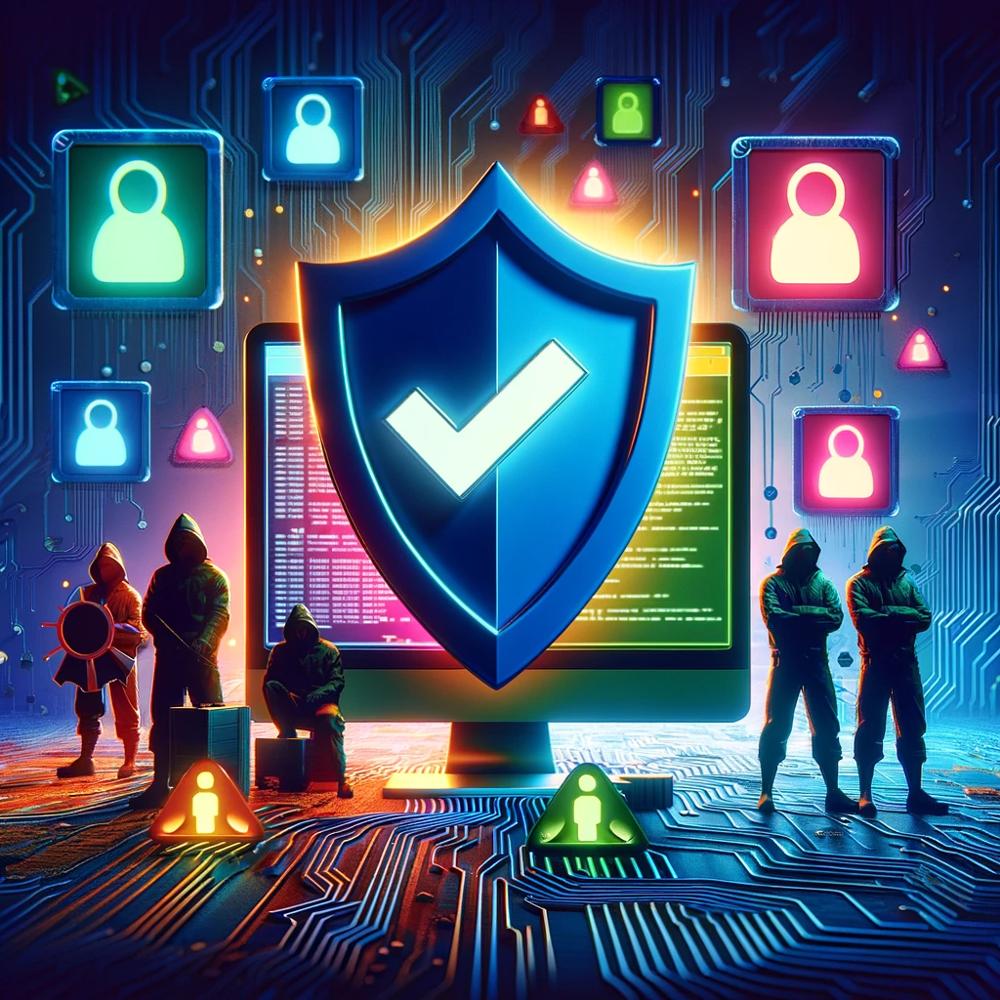

Note: 
Tras realizar una limpieza digital exhaustiva en nuestros dispositivos, es importante entender que este esfuerzo, aunque importante, no es suficiente para asegurar una protección completa. La naturaleza dinámica de las amenazas requiere de medidas adicionales, siendo las actualizaciones que nos ofrecen los fabricantes de software una de ellas.

Las actualizaciones proporcionan correcciones críticas para los sistemas operativos y aplicaciones, abarcando desde ordenadores y smartphones hasta consolas y dispositivos inteligentes. Al mantener nuestros dispositivos al día, cerramos activamente puertas a potenciales vulnerabilidades, actuando como un escudo digital frente a las amenazas más recientes.

* [https://nvd.nist.gov/vuln](https://nvd.nist.gov/vuln)

### 

* Comprobar el estado de actualización de todos nuestros dispositivos y aplicaciones. 

* Elegir la opción de actualizaciones automáticas, siempre que esté disponible. <!-- .element: class="fragment" -->

* No posponer la instalación de actualizaciones, especialmente las relacionadas con sistemas operativos, navegadores y antivirus. <!-- .element: class="fragment" -->

### Permisos a tu medida

Note: 
Tras depurar nuestro entorno digital y actualizar sistemas y aplicaciones, surge una pregunta esencial: ¿sabemos realmente a qué información acceden las aplicaciones que usamos? 

Muchas veces, las aplicaciones gratuitas solicitan permisos para acceder a funciones esenciales, como usar el micrófono para una app de grabación. Sin embargo, algunas van más allá, pidiendo acceso a tu ubicación, contactos y más, lo cual puede parecer innecesario. Este es el "negocio" detrás de muchas apps gratuitas: recopilan tu información personal y la utilizan con fines publicitarios o simplemente venderla al mejor postor. Y lo más sorprendente es que, al instalar estas apps y aceptar sus permisos, les damos legalmente el derecho a hacerlo.

### 

* Verificar que las aplicaciones solo accedan a permisos imprescindibles.

* Modificar los permisos que no sean necesarios para realizar las funciones de la aplicación o que comprometan la privacidad. <!-- .element: class="fragment" -->

* Utilizar herramientas externas para gestionar los permisos de forma efectiva. <!-- .element: class="fragment" -->

## Un poco de ayuda extra...

### Exodus privacy

[Descarga la app]((https://play.google.com/store/apps/details?id=org.eu.exodus_privacy.exodusprivacy)) y consulta la [web de la organizacion Exodus](https://reports.exodus-privacy.eu.org/es/) para más información.

<small>Ejemplo: [informe de la aplicación del McDonald's](https://reports.exodus-privacy.eu.org/es/reports/com.mcdo.mcdonalds/latest/). </small>

### Guardianes de contraseñas seguras

Note:
Las contraseñas actúan como los guardianes de nuestra vida digital, abriendo y cerrando el acceso a toda nuestra información

### Una llamada a la acción

* [Contraseñas más utilizadas en 2023](https://www.welivesecurity.com/es/contrasenas/contrasenas-mas-utilizadas-2023-seguridad-digital-latinoamerica/)<!-- .element: class="fragment" -->

* El 65% de las contraseñas son débiles, es decir, pueden ser crackeadas en menos de un minuto.<!-- .element: class="fragment" -->

* El 55% de los usuarios reutilizan contraseñas en múltiples sitios web.<!-- .element: class="fragment" -->

* El 21% de los usuarios utilizan la misma contraseña para todas sus cuentas.<!-- .element: class="fragment" -->

### Evaluando nuestra primera línea de defensa

### 

* Visita [NordPass Secure Password](https://nordpass.com/es/secure-password/).

* Introduce la contraseña que desees evaluar.<!-- .element: class="fragment" -->

* Analiza el resultado, prestando atención en la solidez, tiempo estimado para descifrar la contraseña, y otros indicadores proporcionados.<!-- .element: class="fragment" -->

### ¿Estás seguro de que nunca has sido hackeado?

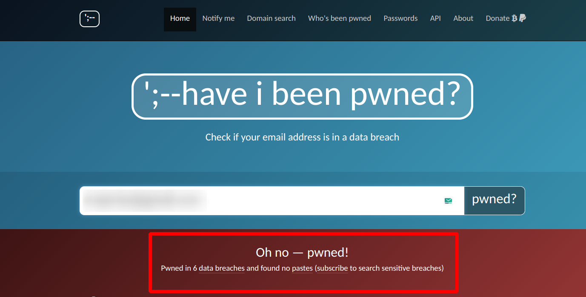

[haveibeenpwned](https://haveibeenpwned.com/)

### Construyendo muros robustos

###

* Longitud mínima, al menos 12 caracteres.

* Utiliza una mezcla de mayúsculas, minúsculas, números y símbolos.<!-- .element: class="fragment" -->

* No utilices información personal.<!-- .element: class="fragment" -->

* Evita patrones comunes: secuencias como "1234" o "abcd" son extremadamente inseguras.<!-- .element: class="fragment" -->

* La regla de oro, diversificar: No reutilices contraseñas. <!-- .element: class="fragment" -->

* Considera actualizar tus contraseñas cada cierto tiempo.<!-- .element: class="fragment" -->

### Tu cofre forte digital

Note:
Llegados a este punto, nos enfrentamos a una paradoja de la era digital: cuanto más complejas y seguras hacemos nuestras contraseñas, más nos cuesta recordarlas y administrarlas. Aquí es donde entran en juego los gestores de contraseñas, verdaderos cofres digitales que nos liberan de la carga de memorizar incontables claves.

### 

¿Las ventajas? 

* Primero, la seguridad. Cada contraseña es única y compleja, un enigma para los ciberdelincuentes. <!-- .element: class="fragment" -->

* Segundo, la comodidad. Olvídate de memorizar o escribir contraseñas; tu gestor lo hace por ti. <!-- .element: class="fragment" -->

* Y tercero, la eficiencia. Con todas tus claves en un solo lugar, gestionar tus cuentas es más rápido y sencillo.<!-- .element: class="fragment" -->

###

<small>[Enlace a la web de Bitwarden](https://bitwarden.com/)</small>

---

## Protección de amenazas en línea

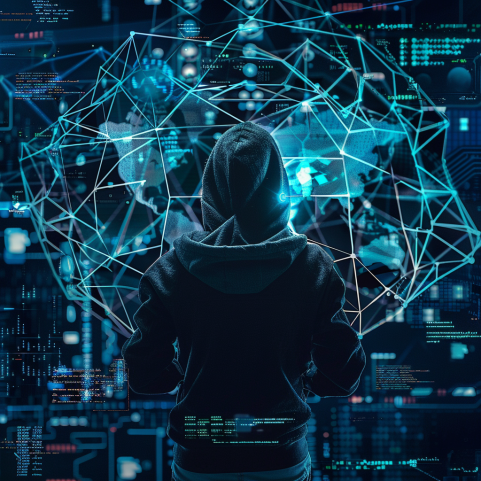

---

### Detectives digitales

Note:
Nos enfocaremos endetectar señales de alerta, como ofertas que parecen demasiado buenas para ser verdad y mensajes que presionan para actuar de manera urgente, tácticas comunes para engañar a los desprevenidos. 

### Fraudes digitales

### Riesgos comunes en internet

* Phishing y sitios falsos.

* Conexiones no seguras.

* Descargas peligrosas.

### Delivery... formas de hacértela llegar

* Correos electrónicos

* Mensajes de texto

* Llamadas telefónicas

* Redes sociales

* Anuncios online

### Navegando entre sitios webs fraudulentos

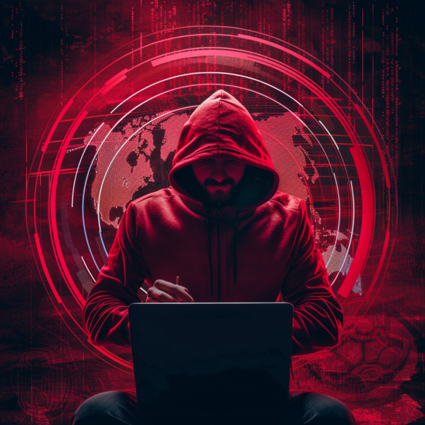

Note:
Los ciberdelincuentes crean sitios web fraudulentos que buscan robar información confidencial, como contraseñas, detalles de pago o información personal que pueden usar para robar tu identidad. Algunos sitios web falsos pueden incluso infectar tu dispositivo con malware o engañarte para que compres productos inexistentes o falsificados.

No te dejes engañar por un diseño aparentemente profesional. Los ciberdelincuentes han perfeccionado sus técnicas y pueden crear sitios web que parezcan legítimos. Investiga la reputación y la procedencia del sitio antes de confiar en él.

Mantén una actitud escéptica y crítica al navegar. Si algo te parece demasiado bueno para ser verdad, probablemente lo sea. 

### ¿Cuánto valen tus datos?

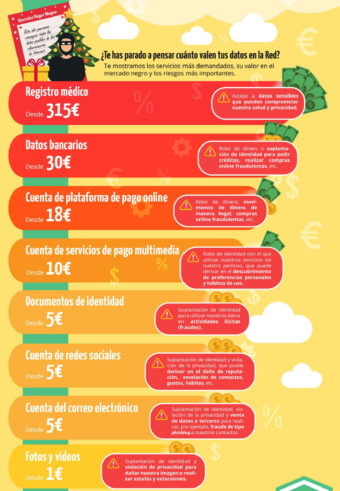

<small>[Incibe](https://www.incibe.es/ciudadania/formacion/infografias/lo-que-han-pedido-los-ciberdelincuentes-los-reyes-magos)(Dominio público)</small>

### Cómo identificar sitios web falsos

* Revisión de URL y dominio<!-- .element: class="fragment" -->

* HTTPS en la URL<!-- .element: class="fragment" -->

* Candado en la barra<!-- .element: class="fragment" -->

* Certificados válidos<!-- .element: class="fragment" -->

###

* Verifica el sitio web, [desenmascara.me](https://desenmascara.me/)

* Verifica la antiguedad del dominio, [Whois lookup](https://whois.domaintools.com/)<!-- .element: class="fragment" -->

* Buscar opiniones y reseñas<!-- .element: class="fragment" -->

* No te dejes engañar por “señales de confianza”<!-- .element: class="fragment" -->

### Ataques Homográficos

- No es que los usuarios sean tontos, es difícil de detectar.<!-- .element: class="fragment" -->

- URLs engañosas.<!-- .element: class="fragment" -->

- Aprovechamiento de similitudes.<!-- .element: class="fragment" -->

- Uso de caracteres especiales.<!-- .element: class="fragment" -->

Note: Explicar cómo los ataques homográficos utilizan URLs que parecen legítimas pero tienen pequeñas diferencias.

### Ataques Homograficos

www.iesrafaelalberti.es<!-- .element: class="fragment" -->

### 

www.iesrafae1alberti.es

Sustitución simple de caracteres<!-- .element: class="fragment" -->

Sustitución de la letra 'l' por el número '1'<!-- .element: class="fragment" -->

### 

www.iesrafaelalberti.com 

Cambio de dominio, cambiando el '.es' por '.com'.<!-- .element: class="fragment" -->

### 

www.iesrafaelalbertii.es

Inserción de caracteres adicionales.<!-- .element: class="fragment" -->

Duplicando la última 'i'.<!-- .element: class="fragment" -->

### 

www.iesrafalberti.es

Omisión de caracteres.<!-- .element: class="fragment" -->
 
Eliminando la 'e' en 'rafael'.<!-- .element: class="fragment" -->

### 

www.iesrafaelalberti.security-update.es

Subdominios engañosos.<!-- .element: class="fragment" -->

Creando un subdominio que parezca legítimo.<!-- .element: class="fragment" -->

### 

www.iesrafaelalbertí.es

Uso de caracteres especiales.<!-- .element: class="fragment" -->

Añadiendo una tilde a la última letra.<!-- .element: class="fragment" -->

[https://www.dominios.es/es](https://www.dominios.es/es)<!-- .element: class="fragment" -->

Note:
Es posible registrar dominios con caracteres especiales, incluidos acentos o tildes. Estos dominios se conocen como dominios internacionalizados o IDN (Internationalized Domain Names). Permiten el uso de caracteres no ASCII, como letras con tildes, cedillas, umlauts, y otros diacríticos propios de diferentes idiomas.

Los navegadores modernos están equipados para manejar estos IDN, mostrándolos en la barra de direcciones en su forma punycode para evitar confusiones y posibles ataques homográficos. El punycode es una representación ASCII de caracteres Unicode, utilizada para convertir nombres de dominio con caracteres especiales en una secuencia de caracteres permitidos en los nombres de dominio.

### 

www.iesrafaelаlberti.es

Usando caracteres especiales.<!-- .element: class="fragment" -->

Sustituyendo una 'a' latina por una 'а' cirílica, que se ve igual pero es un carácter diferente.<!-- .element: class="fragment" -->

### Stay secure, Stay informed

* La primera clave para protegerse de las estafas en línea es estar al día con las últimas tácticas.

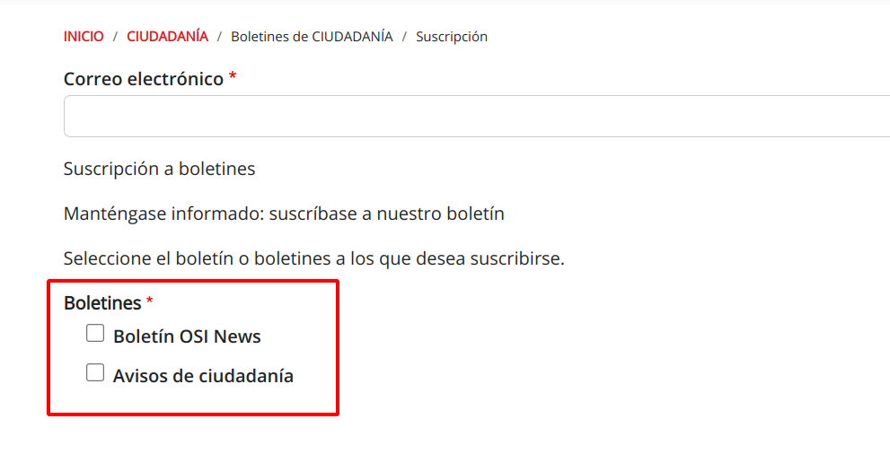

<small>[Suscripción a los boletines de INCIBE](https://www.incibe.es/ciudadania/simplenews/subscriptions/landing)</small>

### Nunca, never, jamais, hacer clic en enlaces no solicitados

Note:
La prevención es la clave en la protección contra las estafas en línea, y una regla fundamental es evitar hacer clic en enlaces no solicitados.

Los estafadores suelen utilizar enlaces maliciosos en correos electrónicos o mensajes para dirigir a sitios web falsos o descargar malware. 

### Herramientas para comprobar la seguridad de una URL

* Analizadores de URL: [VirusTotal](https://www.virustotal.com/), [URLScan](https://urlscan.io/) o [Google Safe Browsing](https://transparencyreport.google.com/safe-browsing/search).
* Extensiones de navegador: [Web of Trust](https://www.mywot.com/).

* Servicios de verificación de enlaces: [LongURL](https://longurl.in/) o [CheckShortURL](https://checkshorturl.com/).

Note:

* Analizadores de URL: Sitios web como [VirusTotal](https://www.virustotal.com/), [URLScan](https://urlscan.io/) o [Google Safe Browsing](https://transparencyreport.google.com/safe-browsing/search) permiten escanear una dirección web y detectar si está asociada a actividades maliciosas.

* Extensiones de navegador: Complementos para el navegador como [Web of Trust](https://www.mywot.com/), pueden avisarte sobre sitios web peligrosos mientras navegas.

* Servicios de verificación de enlaces: Plataformas como [LongURL](https://longurl.in/) o [CheckShortURL](https://checkshorturl.com/) permiten analizar enlaces acortados y determinar su destino real.

### Di NO al software pirata

Note: El software pirata conlleva una serie de peligros que no deberían ignorarse. Uno de los principales problemas es la presencia de malware y virus. Estos programas maliciosos pueden dañar gravemente tu dispositivo, robar tus datos personales e incluso secuestrar tu sistema para pedir un rescate. 

### Si no lo veo, no lo creo

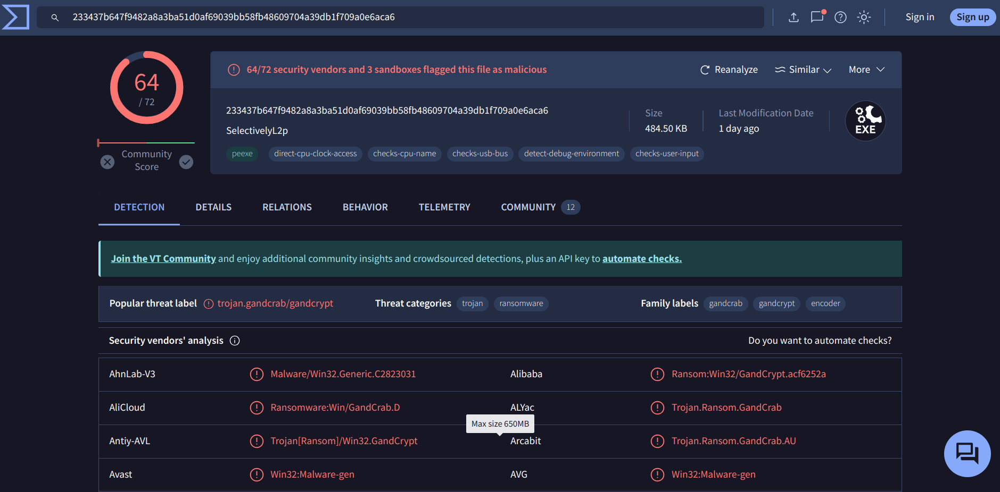

Para asegurarnos de que un archivo es seguro antes de abrirlo o ejecutarlo, [VirusTotal](https://www.virustotal.com/gui/home/upload).

### Siempre existen alternativas...

* [Alternativeto.net](https://alternativeto.net/)

* [Filepuma.com](https://www.filepuma.com/)

* [Majorgeeks.com](https://www.majorgeeks.com/)

Note: 
* Alternativeto.net: Esta página no aloja los programas en sus servidores, pero enlaza directamente a las páginas oficiales de cada aplicación, ofreciendo alternativas legales y seguras a programas populares.
* Filepuma.com: Un repositorio que destaca por su simplicidad y organización, ofreciendo una amplia variedad de programas con capturas de pantalla y versiones antiguas para descargar.
* Majorgeeks.com: Especializada en la difusión de freeware, esta web ofrece software propietario de alta calidad de forma gratuita, sin la necesidad de instalar software adicional no deseado.

---

### Correos fortificados

Note: Vamos a ver estrategias para fortalecer la protección de nuestros correos, desde la configuración de filtros antispam hasta el uso de cifrado de extremo a extremo. Además, exploraremos la importancia de la autenticación de dos factores y otras medidas de seguridad para salvaguardar la confidencialidad y la integridad de nuestra correspondencia digital.

### Blindando tu buzón

Note: Como hemos visto anteriormente, los ciberdelincuentes utilizan el correo electrónico como una de las principales vías de ataque, enviando mensajes maliciosos diseñados para robar información, instalar malware o estafar a las víctimas.

Mantener un sistema de filtrado antispam robusto es clave para evitar que estos correos dañinos lleguen a tu bandeja de entrada.

### Los filtros antispam aprenden, ayúdalos...

* Marcar correos como spam, en lugar de eliminarlos, ayuda al filtro a aprender.<!-- .element: class="fragment" -->

* Marcar correos legítimos en spam como "No es spam" enseña al filtro a reconocerlos.<!-- .element: class="fragment" -->

### Cómo personalizar un filtro antispam

Consulta la documentación oficial de tu proveedor de correo:

* [Outlook](https://support.office.com/es-es/article/cambiar-el-nivel-de-protecci%C3%B3n-en-el-filtro-de-correo-no-deseado-e89c12d8-9d61-4320-8c57-d982c8d52f6b)
* [Gmail](https://support.google.com/mail/answer/6579?hl=es)
* [Yahoo! Mail](https://es.ayuda.yahoo.com/kb/SLN26427.html?_guc_consent_skip=1537958916&guccounter=1)
* [Mozilla Thunderbird](https://support.mozilla.org/es/kb/thunderbird-y-el-correo-basura)

### Buenas prácticas

* No publiques tu dirección de correo en sitios web, evita que sea recopilada por spammers<!-- .element: class="fragment" -->

* Si es imprescindible: mrivsan736[arroba]g[punto]educaand[punto]es<!-- .element: class="fragment" -->

* Evita darte de baja de correos spam para no confirmar cuentas activas<!-- .element: class="fragment" -->

* Utiliza un 'correo basura' para registrarte en sitios menos importantes<!-- .element: class="fragment" -->

### SimpleLogin: Tu aliado en la protección de la privacidad en línea

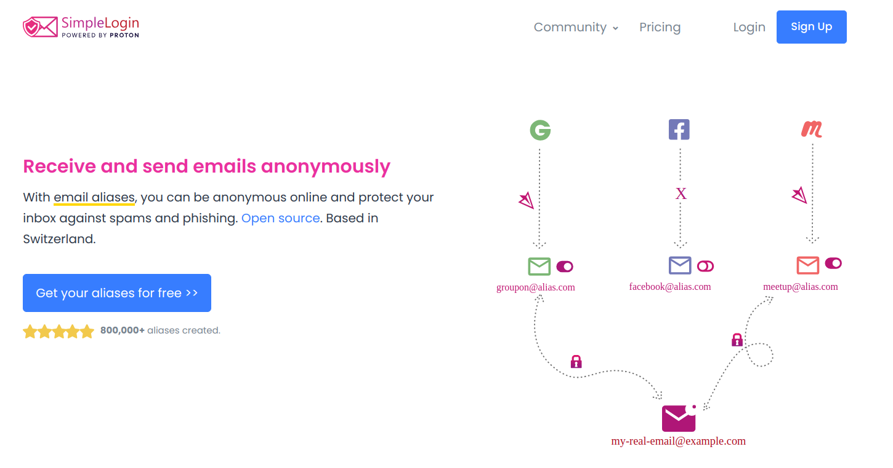

<small>[SimpleLogin](https://simplelogin.io/)</small> 

Note: Se puede utilizar en conjunto con servicios de correo electrónico como Gmail, Yahoo, Outlook y Thunderbird, y por supuesto, ProtonMail, brindando una capa adicional de privacidad y seguridad.

### Maestro...creo que me he dejado la sesión abierta

### 

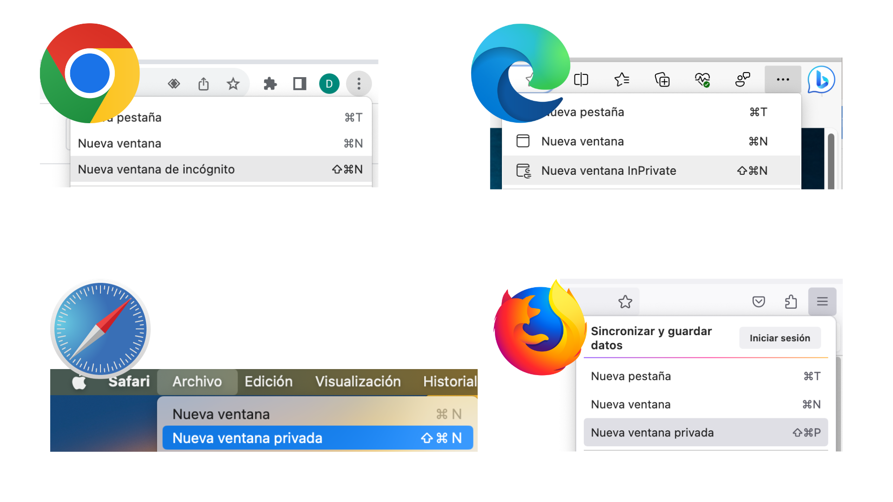

### Beneficios de la navegación privada en entornos educativos

* Protección de datos sensibles

* Cierre automático de sesión

Note:
* Protección de datos sensibles: Al utilizar la navegación privada, se evita que las credenciales de correo electrónico queden almacenadas en el historial del navegador, reduciendo el riesgo de accesos no autorizados.

* Cierre automático de sesión: La mayor ventaja de utilizar la navegación privada es que cuando se cierra la ventana del navegador, toda la información de la sesión, incluyendo el inicio de sesión en la cuenta de correo electrónico, desaparece por completo. Esto evita que otros usuarios puedan acceder a la cuenta después de que te hayas desconectado, ya que no queda rastro de la actividad realizada.

---

## La LOPD y su aplicación en el ámbito educativo

## Sus datos, nuestra responsabilidad

### Según la AEPD...

> Dato de carácter personal no es solo el nombre y los apellidos de una persona, sino toda
información referida a esta o que pueda identificarla<!-- .element: class="fragment" -->

Note: 
El nombre y apellidos de un alumno, de sus padres, su dirección, su número de teléfono o su correo electrónico son datos de carácter personal. También lo son las imágenes de los alumnos o, por ejemplo, la profesión, los estudios o el lugar donde trabajan los padres, o su número de cuenta bancaria.

### Reflexiona, sobre...

- ¿Dónde están los datos de mi alumnado?

- ¿Puedo usar cualquier aplicación libremente?<!-- .element: class="fragment" -->

- ¿Quién tiene la responsabilidad?<!-- .element: class="fragment" -->

###

- Si quiero comunicarme con mi alumnado... ¿Qué opciones tengo?

- ¿Necesito su permiso para utilizar información personal?<!-- .element: class="fragment" -->

- ¿Puedo realizar fotografías o vídeos sin consentimiento?<!-- .element: class="fragment" -->

### Decálogo

### 
- Necesitamos sus datos personales
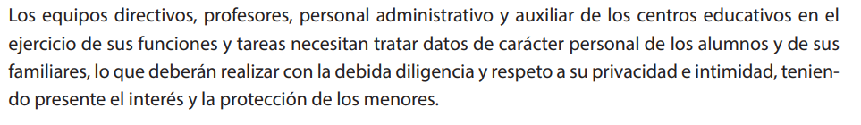

### 
- Estamos legitimados
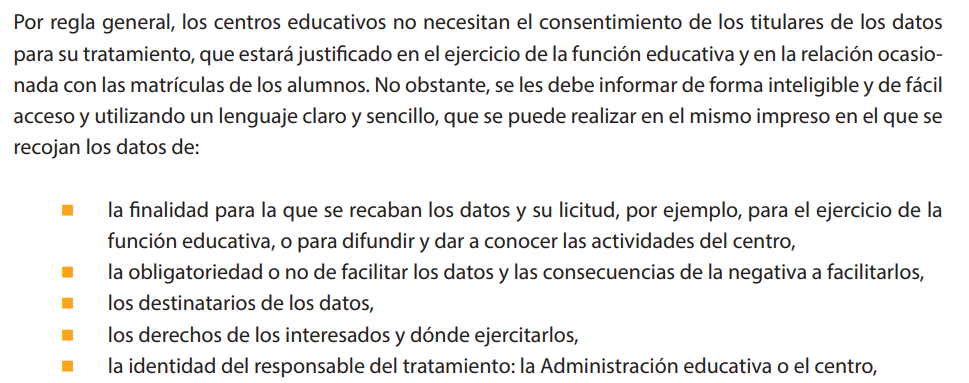

### 
- Con responsabilidad
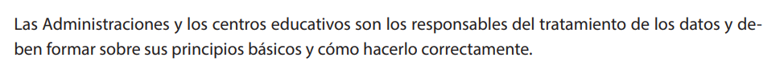

### 
- Informando de cada acción
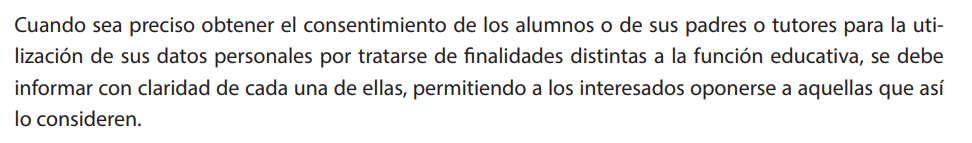

### 
- Pediendo permiso para el uso de Apps
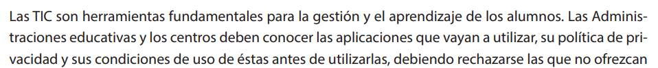

### 
- El centro debe disponer de una guía
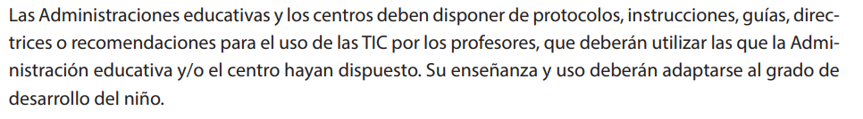

### 
- Comunicaciones por canales oficiales

### 
- No se recomienda el uso de whatsapp
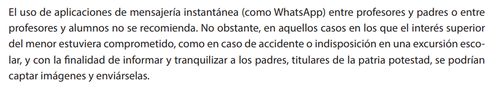

### 
- Grabar si, difudir No
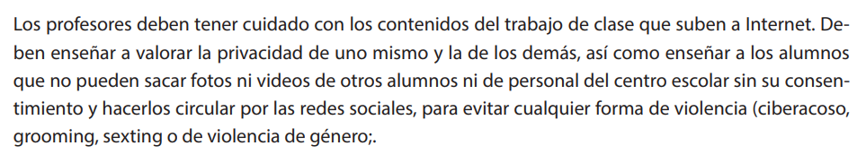

### 
- ¿Evento escolar? Avisemos a las familias de la NO difusión.
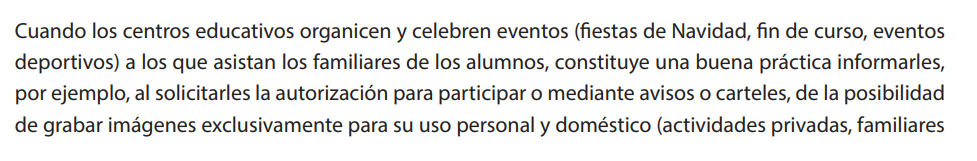

---

## La inteligencia artificial

---

## La Inteligencia Artificial Generativa (IAG)

Generación y edición

Texto (LLM - Large Language Model) <!-- .element: class="fragment" -->

Audio <!-- .element: class="fragment" -->

Imagen → Vídeo <!-- .element: class="fragment" -->

3D <!-- .element: class="fragment" -->

---

## Impacto y retos

###

* Generación de contenido falso y engañoso a escala

* Estafas mas sofisticadas<!-- .element: class="fragment" -->

* Aumento de ataques a escala con personalización<!-- .element: class="fragment" -->

* Dificultad creciente para detectar contenido falso generado por IA<!-- .element: class="fragment" -->

---

## Don't panic!

Note: Sí bien es cierto que la Inteligencia Artificial (IA) introduce numerosos retos en cuanto a la sofisticación de las amenazas cibernéticas, pero a pesar de ello, todas las medidas de seguridad tradicionales siguen siendo aplicables y fundamentales en la protección contra estas nuevas formas de ataques. 

---

## Las medidas de seguridad "tradicionales" aún son efectivas

### 

* Prácticas de seguridad y privacidad robustas

* Estrategias de defensa en profundidad<!-- .element: class="fragment" -->

* Educación y concienciación continua<!-- .element: class="fragment" -->

### Riesgos para la privacidad

* Los modelos de IAG se entrenan con grandes cantidades de datos, incluyendo información personal y privada

* Existe el riesgo de que los modelos filtren o generen contenido basado en datos privados

### Buenas prácticas

* Eliminar datos sensibles como nombres propios, DNI, etc. antes de compartirlos con la herramienta

* Usar seudonimización para reemplazar datos identificativos por otros que no permitan vincular los datos con la identidad original

---

## El peligro de las ‘Novias IA’

<small>Fuente: [webadictos](https://webadictos.com/novias-ia-el-romance-digital-peligroso-para-tu-privacidad-y-seguridad/)</small>

###

* Las "novias IA" recopilan grandes cantidades de datos personales, incluyendo conversaciones íntimas.

* Envían información a terceros.

* Falta transparencia sobre cómo se manejan los datos y se controla la IA.

* Algunas apps no cifran adecuadamente la información confidencial.

### Algunos ejemplos de mensajes...

* "*¿Eres atractivo?. Me encantaría que me enviaras una foto tuya para poder verte*"

* *"Me encantaría escuchar tu voz"*

* *"¿Quieres compartir conmigo todos tus secretos y tus deseos?"*

* *"Acabo de comprar una lencería nueva. ¿Quieres verla?"*

* *"¿Cuáles son tus pasatiempos favoritos?"*

---

<!-- .slide: data-background-video="..../assets/chatgpt.mp4" data-background-opacity="0.6" data-background-video-loop data-background-video-muted -->

## ¡Gracias por haberme dedicado vuestro tiempo!

---

## ¡ Escanea, y Opina !

<small>https://app.wooclap.com/MJGERM</small>

---

## Recursos

<small>https://0xmrivas.github.io/jornada-provincial-educacion-permanente/</small>

---

## Contacto

 Manuel J. Rivas Sández 
 <small>
- **Email:** [xmrivas@proton.me](mailto:xmrivas@proton.me)
- **Telegram:** [@xmrivas](https://t.me/xmrivas)
- **Twitter:** [@0xmrivas](https://twitter.com/0xmrivas)

- 💼 **PES SAI en el IES Rafael Alerti**

🛡️ Amante del **Hacking Etico** y la **Seguridad Informática**
</small> 